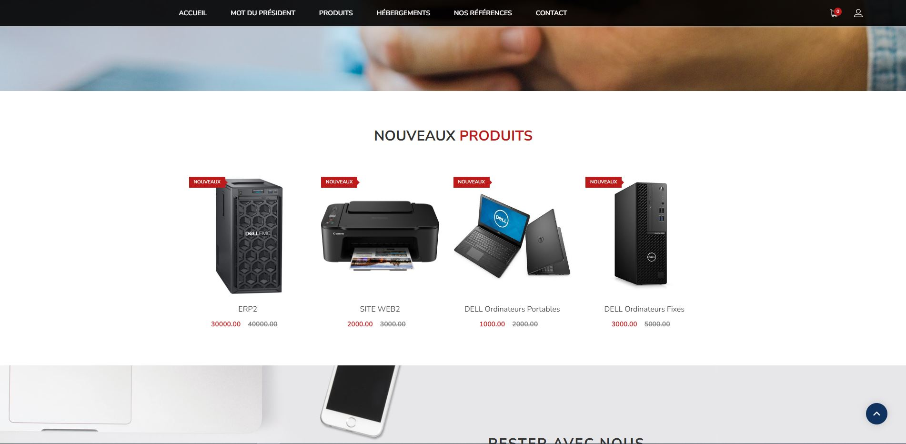
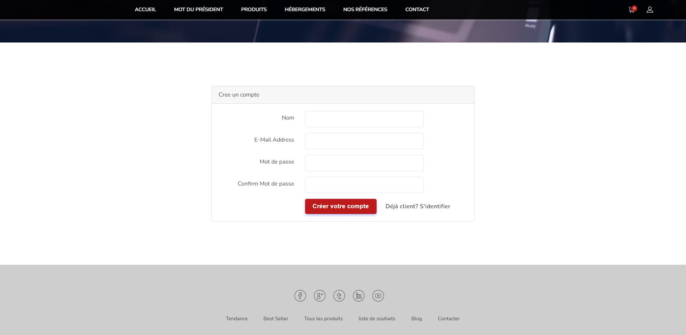
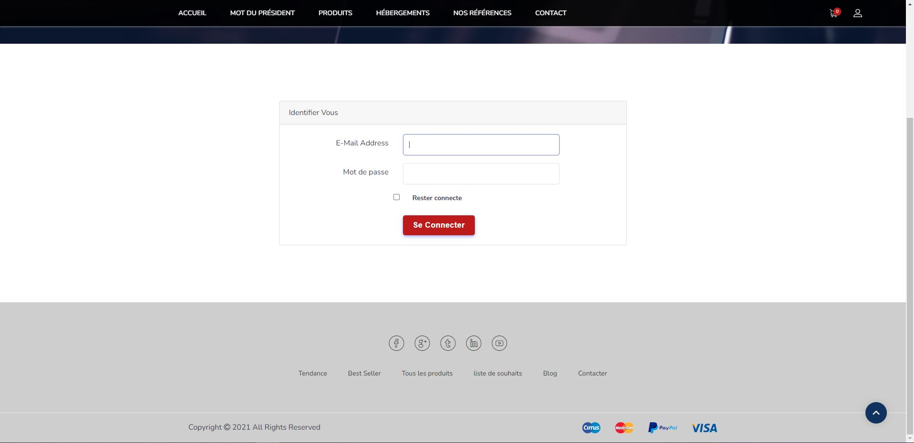
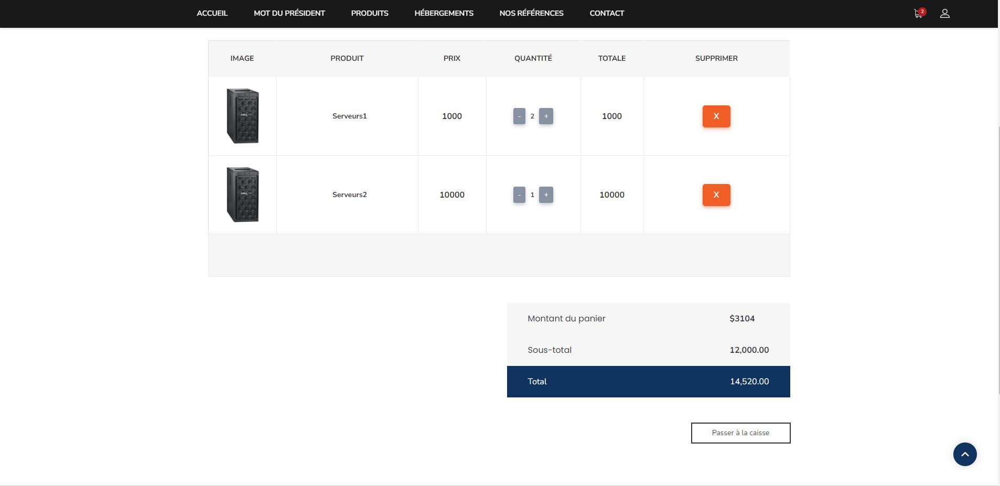
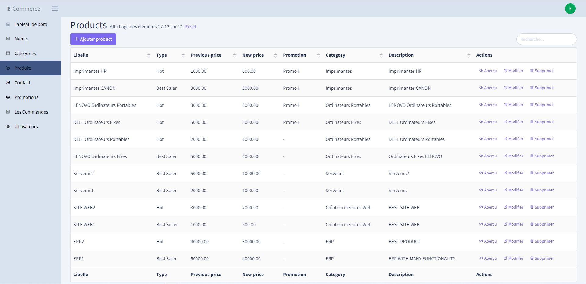

## About the app
this an e-commerce app.

## Tech Stack
   

 


## Some images
### Home page

### Create account

### Login page

### Product list

### Admin Panel by backpack for laravel


## To run the project locally use this commands by orders
#### 1. Clone the Repository:

First, open your terminal or command prompt and navigate to the directory where you want to clone the Laravel project. Then, run the following command to clone the repository. Replace <repository-url> with the URL of the GitHub repository:
```bach
git clone https://github.com/khalidchoukhmane/Home-booking.git
```

#### 2. Navigate to the Project Directory:

Navigate into the Laravel project directory:
```bach
cd e-commerce
```
#### 3. Install Composer Dependencies:

Laravel projects use Composer, a dependency manager for PHP, to manage their dependencies. Run the following command to install the required packages:
```bach
composer install
```

#### 4. Create a Copy of the .env File:

Laravel uses an .env file for environment-specific configuration. Make a copy of the .env.example file and rename it to .env:
```bach
cp .env.example .env
```

#### 5. Generate Application Key:

In the .env file, there's a variable called APP_KEY. You need to set this to a random string. Laravel provides an Artisan command to generate this key:
```bach
php artisan key:generate
```

#### 6. Configure the Database:

In the .env file, configure the database connection settings (such as database name, username, and password) according to your local setup.

#### 7. Run Migrations and Seed Data (if applicable):

If the project includes database migrations and seeders, you need to run them to set up the database schema and initial data:
```bach
php artisan migrate --seed
```
#### 8. Serve the Application:

You can use Artisan to serve the application locally. By default, it will use localhost on port 8000. Run the following command:
```bach
php artisan serve
```
